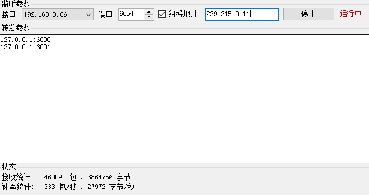
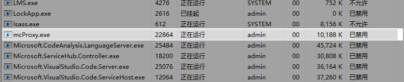
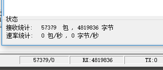

## LICENSE

MIT

## 说明

 mcProxy(muticast proxy tool)是一个将组播数据转换到单播udp的工具，此工具的转换是单向的，用于某些情况下不便于实现组播通信的场景。

## 功能

- 可选择的监听接口
- 可选择的监听接口
- 自定义的组播地址
- 可配置的转发列表

### 软件主界面

### 资源占用

CPU和内存占用

数据总量统计

